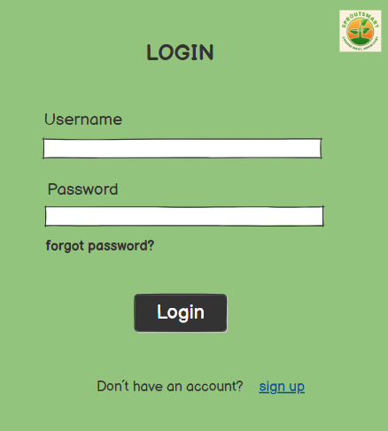
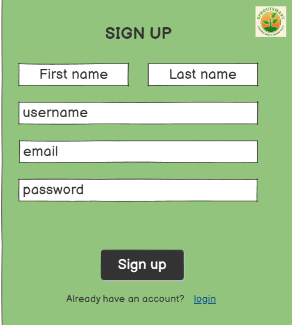
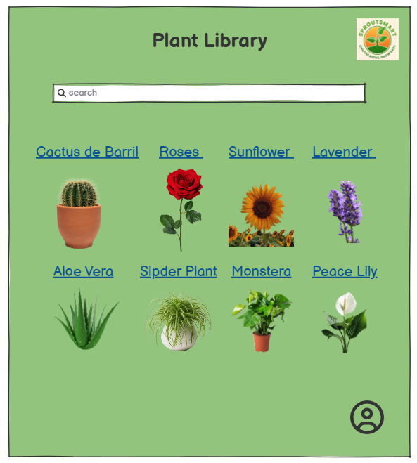
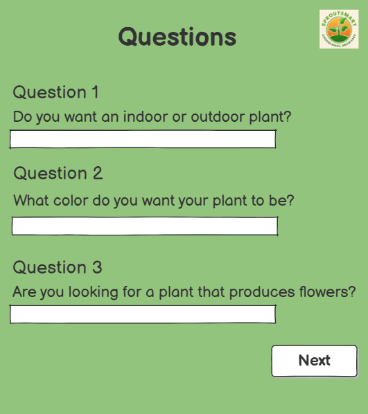
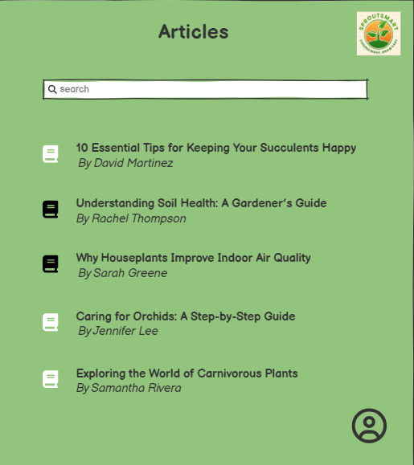

# SproutSmart

## Contents

- [Team](#team)
- [Vision and Scope](#vision-and-scope)
- [Requirements](#requirements)
  - [Use case diagram](#use-case-diagram)
  - [Mockups](#mockups)
  - [User stories](#user-stories)
- [Definition of Done](#definition-of-done)
- [Architecture and Design](#architecture-and-design)
  - [Domain Model](#domain-model)
- [Risk Plan](#risk-plan)
- [Pre-Game](#pre-game)
- [Release Plan](#release-plan)
  - [Release 1](#release-1)
  - [Release 2](#release-2)
- [Increments](#increments)
  - [Sprint 1](#sprint-1)
  - [Sprint 2](#sprint-2)
  - [Sprint 3](#sprint-3)

## Team

- Diogo Oliveira - 2021146037 - a2021146037@isec.pt
- Gabriel Duarte- 2021114516 - a2021114516@isec.pt
- Martim Antunes - 2022141890 - a2022141890@isec.pt
- Pedro Faneca - 2022134142 - a2022134142@isec.pt
- Tomás Laranjeira - 2021135060 - a2021135060@isec.pt

---

## Vision and Scope

#### Problem Statement

##### Project background

Many people find it difficult to keep their plants healthy and well cared for. They often choose plants that are too difficult to maintain or don't fit their environment, leading to frustration when the plants don't thrive. This can result in feelings of failure and discouragement from continuing with their plant care journey.

##### Stakeholders

- E-commerce platforms for plants and gardening products
- Universities and Research Institutions
- Plant lover communities and gardeners
- Wellness and Interior Design Companies

##### Users

- Anyone interested in houseplants
- Plant care product sellers.
- Researchers and article writers.

---

#### Vision & Scope of the Solution

##### Vision statement

The goal of this project is to empower anyone interested in having houseplants to make informed choices and care for them with ease and confidence. The platform will offer personalized recommendations based on the user's lifestyle and preferences, providing ongoing support to ensure long-term success. The vision is to create a simple and accessible experience for everyone, from beginners to plant enthusiasts, promoting personal well-being and a greener home environment.

##### List of features

Personalization & Recommendations:

- Survey about the kind of plants in which the user has interest, in order to get personalized plant suggestions.
- Personalized care product reccomendations.

Plant Care & Tracking:

- Plant Care Progress.
- Maintenance Timelines.
- Plant care reminders.

Guides and Resources:

- Plant care guide.
- Plant library.

Community:

- Articles.

##### Features that will not be developed

- AI capable of diagnosing issues with the plants just from images.
- Fully automated systems that can water, change lighting and humidity levels, and send care instructions based on the health of the plant remotely.
- Extensive environmental monitoring such as air quality and specific soil nutrient levels.
- Plant species recognition for every species on the planet.
- Quick growth options that promise to accelerate or improve plant development.

##### Assumptions

It is assumed:

- Sales are external to the application, so we will not deal with sales.
- Our plant database will have a limited ammount of plants(about 50).
- When AILLM recommends a plant, it is already in the plant database.

---

## Requirements

### Use Case Diagram

---

### Mockups

### User Storie 1

### User Stories 2

### User Stories 3

### User Stories 4

### User Stories 5

### User Stories 6

### User Stories 7

### User Stories 8

---

### User Stories

- User story 1 (#28)
- User story 2 (#27)
- User story 3 (#21)
- User story 4 (#25)
- User story 5 (#23)
- User story 6 (#26)
- User story 7 (#24)
- User story 8 (#29)

---

## Definition of done

(This section is already written, do not edit)
It is a collection of criteria that must be completed for a User Story to be considered “done.”

1. All tasks done:

- CI – built, tested (Junit), reviewed (SonarCloud)
- Merge request to qa (code review)

2. Acceptance tests passed
3. Accepted by the client
4. Code merged to main

---

<!-- ##### User Story 1

As a student, I want to set deadlines for my assignments so that I can manage my time efficiently.

##### User Story 2
As a user, I want to earn badges for completing tasks so that I can feel a sense of accomplishment.

##### User Story 3
As a fitness enthusiast, I want to track my exercise routines so that I can maintain a consistent workout schedule.

##### User Story 4
As a learner, I want to monitor my study hours so that I can ensure I'm preparing adequately for exams.

##### User Story 5
As a gardener, I want to set reminders for watering and pruning plants so that I can maintain a healthy garden.

##### User Story 6
As a blogger, I want to set a habit of writing a post every week so that I can engage my audience regularly.

 -->

## Architecture and Design

#### Domain Model

<!---->

---

## Risk Plan

##### Threshhold of Success

<!---
The project fails if:
 Essential features such as habit tracking, visual progress insights, task and habit management, reminders, and goal setting are incomplete or not functioning as intended.
Users find it difficult to navigate the app or encounter usability issues, leading to dissatisfaction and disengagement.
Reminders are unreliable, causing users to miss their tasks and habits frequently.
Milestone tracking for goals is confusing or not visually represented clearly, leading to user frustration.

- The "must" user stories are not developed
- The app is not in a working condition upon release.
The team is not satisfied with the app and their work on the project, based on a questionare at the last meeting before final release. -->

The project is successful if:

<!--- By the final release date, all essential features, namely habit tracking, task and habit management and reminders, are fully implemented and pass acceptance tests without critical defects.
Users find the app intuitive, user-friendly, and engaging, leading to positive feedback and a high level of satisfaction.
Reminders are delivered accurately and on time, ensuring users can effectively manage their tasks and habits.
Milestone tracking for goals is visually appealing, easy to understand, and provides users with a sense of achievement and progress. -->

- All "must" user stories are developed and tasks assigned to them finished.
- All group members contibuted to the project equally (rounded up to the nearest hour).
- The team is satisfied with the app and their work on the project, based on a questionare at the last meeting before final release.
<!-- - The interface of the app it appealing to most group members and clients. -->

##### Risk List

<!-- - RSK1 - PxI: 4x5=20; Inaccurate Time and Effort Estimations
  - Risk: The team lacks experience in estimating the time and effort required for tasks, leading to underestimations or        overestimations, resulting in unforeseen project delays.
  - Impact: 5
  - Likelihood: 4 -->

- RSK1 – PxI: 3x3=9; Changing Client Requirements or Out-of-Scope Work

  - Risk: Scope creep or changes in client requirements can lead to additional tasks, causing delays, budget overruns, and misalignment with initial project goals.
  - Impact: 3
  - Likelihood: 3

- RSK2 – PxI: 2x3=6; Failure to Meet User Expectations (User Experience Issues)

  - Risk: Poor user experience design or failure to meet user expectations can result in dissatisfaction, reduced engagement, and low retention rates.
  - Impact: 3
  - Likelihood: 2

- RSK3 – PxI: 1x2=2; Integration Issues with Third-Party Services (e.g., Notification APIs)

  - Risk: Problems integrating third-party services such as notification APIs can cause interruptions in app functionality or failure of key features.
  - Impact: 2
  - Likelihood: 1

- RSK4 – PxI: 1x5=5; Integration Issues with critical Third-Party Services (e.g., ChatGPT)

  - Risk: Deficient integration with ChatGPT may lead to service failures or degraded performance, affecting the app's key features reliant on external services.
  - Impact: 5
  - Likelihood: 1

- RSK5 – PxI: 3x2=6; Bugs or Technical Issues During Development or After Release

  - Risk: Bugs or technical glitches during development or post-launch can harm user experience, causing feature breakdowns or security vulnerabilities.
  - Impact: 2
  - Likelihood: 3

- RSK6 – PxI: 1x4=4; Data Security and Privacy Concerns (e.g., User Data Breach)

  - Risk: A data breach or privacy issue could lead to legal ramifications, loss of user trust, and financial penalties.
  - Impact: 4
  - Likelihood: 1

- RSK7 – PxI: 2x3=6; Poor App Performance (Slow Load Times, Lag, Crashes)

  - Risk: Slow load times, lag, or crashes can lead to a poor user experience, causing users to abandon the app.
  - Impact: 3
  - Likelihood: 2

- RSK8 – PxI: 2x3=6; Delays in Project Timeline Due to Insufficient Resources

  - Risk: Insufficient resources may result in missed deadlines and project delays, affecting delivery and stakeholder satisfaction.
  - Impact: 3
  - Likelihood: 2

- RSK9 – PxI: 2x3=6; Lack of Sufficient Testing Leading to Undetected Issues
  - Risk: Inadequate testing can lead to undetected bugs or issues, resulting in a poor-quality product and potential rework post-launch.
  - Impact: 3
  - Likelihood: 2

##### Mitigation Actions (threats>=20)

For each identified risk, a mitigation or response strategy will be developed.

- RSK1: Changing Client Requirements or Out-of-Scope Work
  - Action: Use clear project scope documentation and client approval for each phase to prevent scope creep. Use agile methodologies for iterative feedback.
- RSK2: Failure to Meet User Expectations (User Experience Issues)

  - Action:Conduct thorough user research and prototype testing with users to ensure the app meets user expectations. Iterate based on feedback.

- RSK3:Integration Issues with Third-Party Services (e.g., Notification APIs)

  - Action:Develop fallback mechanisms, monitor API performance, and ensure compatibility through early testing to mitigate potential integration issues with ChatGPT.

- RSK4:Integration Issues with critical Third-Party Services (e.g., ChatGPT)

  - Action:Test third-party service integration early in the development process. Ensure fallback mechanisms are in place for critical features.

- RSK5:Bugs or Technical Issues During Development or After Release

  - Action:Implement automated testing and conduct regular code reviews to minimize bugs. Use continuous integration (CI) practices to detect issues early.

- RSK6:Data Security and Privacy Concerns (e.g., User Data Breach)

  - Action:Follow strict data privacy protocols (e.g., encryption, authentication). Conduct security audits and implement GDPR compliance if applicable.

- RSK7: Poor App Performance (Slow Load Times, Lag, Crashes)

  - Action:Conduct performance testing regularly. Optimize code and server resources for scalability. Use caching and content delivery networks (CDNs) to improve performance.

- RSK8: Delays in Project Timeline Due to Insufficient Resources
  - Action:Ensure accurate resource planning and provide extra buffer time for critical tasks. Reallocate resources if needed to meet deadlines.
- RSK9:Lack of Sufficient Testing Leading to Undetected Issues
  - Action:Develop a comprehensive testing plan that includes unit, integration, and user acceptance testing (UAT). Allocate sufficient time for bug fixing before the release.

## Pre-Game

### Sprint 0 Plan

- Goal: description
- Dates: from 01/Oct to 15/Oct, 2 weeks
- Sprint 0 Backlog (don't edit this list):
  - Task1 – Write Team
  - Task2 – Write V&S
  - Task3 – Write Requirements
  - Task4 – Write DoD
  - Task5 – Write Architecture&Design
  - Task6 – Write Risk Plan
  - Task7 – Write Pre-Gane
  - Task8 – Write Release Plan
  - Task9 – Write Product Increments
  - Task10 – Create Product Board
  - Task11 – Create Sprint 0 Board
  - Task12 – Write US in PB, estimate (SML), prioritize (MoSCoW), sort
  - Task13 – Create repository with “GPS Git” Workflow

---

## Release Plan

### Release 1

- Goal: MVP -><!-- MVP - Developed US1, US3, US4, US6 with a working interface. -->
  - Login in and sign up using credentials
  - Access the plant library, search, and filter through plant information
  - Complete a basic survey to receive personalized plant recommendations
- Dates: 12/Nov
- Team capacity: 4 _ 5 _ 5 = 100 hours
- Release: V1.0

---

### Release 2

- Goal:
  - Improved Survey for Personalized Plant Recommendations.
  - Refining and expanding the plant garden with additional features, such as tasks display and plant healthcare analysis.
  - Display of Articles related to plant healthcare.
- Date: 15/Dec
- Team capacity: 4 _ 5 _ 2 = 40 hours
- Release: V2.0

---

## Increments

### Sprint 1

##### Sprint Plan

- Goal: <!-- Create the base architecture of the app and basic interface. -->

  - Implement login, sign-up, access to the plant library, search and filtering in the plant library, and the plant recommendation survey.

- Dates: from 15/Oct to 29/Oct, 2 weeks

- Roles:

  - Product Owner: Pedro Faneca
  - Scrum Master: Gabriel Duarte

- To do:

  - US1 (#28): As a user, I want to be able to use credentials to access the app, So that I can access the app's functionalities.
    - Task1: Simple login and validation (hardcoded for now).
    - Task2: Create main menu
    - Story Points: S
  - US2 (#27): As a user, I want to be able to create an account using my credentials, So that I can access the app and manage my information.
    - Task1: Sign Up Validation.
    - Task2: Registration.
    - Story Points: S
  - US5 (#23): As a user, I want to ascertain what type of plants are best suited for me.
    - Task1: Basic functionalities for Survey.
    - Task2: Submitting the survey to receive a static recommendation.
    - Story Points: L
  - US6 (#26): As a user, I want access to a plant library that contains detailed information on various plants so I can learn more about the plants I own or am interested in and care for properly.
    - Task1: View static plant's details and tasks.
    - Story Points: M
  - US7 (#24): As a user, I want to access articles and guides on plant care, So that I can improve my knowledge and learn how to take better care of my plants.
    - Task1: Display Article Content and Listing for static articles
    - Story Points: M

- Story Points: 2S+2M+1L

##### Sprint Review

- Analysis: All tasks were done.

- Story Points: 2S+4M+2L

- Version: 0.1

- Client analysis:

  - Sprint 1 was not accepted by the client.
  - Much things were not done and need to be reviewed and redone.

- Conclusions:
  - Redo the Sprint1.
  - Create sporadic tasks, periodic tasks (daily, weekly, monthly, etc.), repeated multiple times, priorities, mark as done.

##### Sprint Retrospective

- What we did well:
  - The use of the SceneBuilder program helped save a lot of time.
  - Bi-weekly team meetings helped keeping everyone up to date.
  - Almost did all the tasks that were supposed to be done.
- What we did less well:
  - Overestimation
- How to improve to the next sprint:
  - Don’t be as conservative about time management.

---

#### Sprint 2

##### Sprint Plan

<!--Tasks for sprint 2: more interface, sorting and filtering of tasks by labels and importance, calendar view of history
US4 - history of habits, their completion-->

- Goal: <!-- Create the base architecture of the app and basic interface. -->

  - Integrate the sign-up and login functionalities with the database, implement the plant library with database management, enable survey submission for recommendations, and integrate LLM for task generation in maintenance timelines.

- Dates: from 29/Oct to 12/Nov, 2 weeks

- Roles:

  - Product Owner: Martim Antunes
  - Scrum Master: Diogo Oliveira
  - QA Engineer: Tomás Laranjeira

- To do:
  - US2 (#27): As a user, I want to be able to create an account using my credentials, so that I can access the app and manage my information.
    - Task1: Sign up Database Integration.
    - Story Points: S
  - US3 (#21): As a user, I want access to a plant library that contains detailed information on various plants so I can learn more about the plants I own or am interested in and care for properly.
    - Task1: Integration Library Access with Database.
    - Task2: Create and manage database regarding Plant Library.
    - Story Points: L
  - US5 (#23): As a user, I want to ascertain what type of plants are best suited for me.
    - Task1: Submitting the survey to receive and manage a recommendation.
    - Story Points: L
  - US10 (#18): As a user, I want to see a maintenance timeline for each of my plants, so that I know when to water, fertilize, or prune them.
    - Task1: LLM Integration for Tasks Generation.
    - Story Points: L
  - US14 (#28): As a user, I want to be able to use my credentials to access the app, so that I can access and manage my information.
    - Task1: Login Database Integration.
    - Task2: Create Users Database.
    - Story Points: L
- Story Points: 1S + 3L

##### Sprint Review

- Analysis: Much better than the last sprint.

- Story Points: 2S+3M

- Version: 0.1

- Client analysis:

  - Sprint 2 done. Almost everything done apart the JUnit tests. Some suggestions were provided regarding the GUI and how that tasks will be displayed.

- Conclusions:
  - Change the GUI to only show todays's, tomorrow's, completed and no date tasks.

##### Sprint Retrospective

- What we did well:
  - The use of Spikes helped the team overcoming obstacles.
  - Two team meatings a week helped keeping everyone up to date.
  - The existence of a QA Engineer helped to increase product quality.
- What we did less well:
  - Underestimation
- How to improve to the next sprint:
  - Early Risk Identification: Perform deeper risk analysis and assess the potential challenges early in the planning phase.
  - Incremental Reviews: Implement more frequent progress reviews to identify challenges sooner and adjust our approach dynamically.
  - Improved Collaboration: Increase team collaboration during complex tasks to leverage shared knowledge and problem-solving early on.

#### Sprint 3

##### Sprint Plan

<!--Tasks for sprint 2: more interface, sorting and filtering of tasks by labels and importance, calendar view of history
US4 - history of habits, their completion-->

- Goal: <!-- Create the base architecture of the app and basic interface. -->

  - Implement tasks generation
  - Implement plant's details generation
  - Enable survey submission for recommendations

- Dates: from 12/Nov to 26/Nov, 2 weeks

- Roles:

  - Product Owner: Tomás Laranjeira
  - Scrum Master: Martim Antunes
  - QA Engineer: Pedro Faneca

- To do:

  - US5 (#23): As a user, I want to ascertain what type of plants are best suited for me.
    - Task1: Submitting the survey to receive and manage a recommendation-continuation.
    - Story Points: L
  - US6 (#26):As a user, I want access to a plant library that contains detailed information on various plants so I can learn more about the plants I own or am interested in and care for properly.
    - Task1: View details of the plant
    - Story Points: M
  - US10 (#18): As a user, I want to see a maintenance timeline for each of my plants, so that I know when to water, fertilize, or prune them.
    - Task1: LLM Integration for Tasks Generation-continuation.
    - Task2: Display and managing plant-specific tasks on timeline.
    - Task3: Adapating tasks to plant type.
    - Task4: Tracking completed tasks.
    - Story Points: L
  - US12 (#20): As a user,I want to see my plants,So that I can monitor their health, growth progress, and ensure they are being properly taken care of.
    - Task1: Create a table for the garden plants.
    - Task2: Display of the garden's plants names.
    - Task3: Display of the garden's plants details.
    - Story Points: M

- Story Points: 2M + 2L

##### Sprint Review

- Analysis: Much better than the last sprint.

- Story Points: 2M+2L

- Version: 0.1

- Client analysis:

  - Sprint 3 done. Everything was done.Some suggestions were provided regarding the GUI.

##### Sprint Retrospective

- What we did well:
  - Two team meetings a week helped keeping everyone up to date
- What we did less well:
  - Package organization
- How to improve to the next sprint:
  - We need to separate the project classes in different packages

#### Sprint 4

##### Sprint Plan

<!--Tasks for sprint 4: more interface, sorting and filtering of tasks by labels and importance, calendar view of history
US4 - history of habits, their completion-->

- Goal:

  - Make Tasks reoccurring.
  - Integrate feeds with articles

- Dates: from 26/Nov to 10/Dec, 2 weeks

- Roles:

  - Product Owner: Diogo Oliveira
  - Scrum Master: Pedro Faneca
  - QA Engineer: Martim Antunes

- To do:

  - US5 (#23): As a user, I want to ascertain what type of plants are best suited for me.
    - Spike: Study of ChatGPT 4 Mini to improve the survey generation.
    - Task1: Option to request a new suggestion if the user didn't like the one it got.
    - Task2: Generate new suggestion on survey.
    - Story Points: L
  - US7 (#24): As a user, I want to access articles and guides on plant care, So that I can improve my knowledge and learn how to take better care of my plants.
    - Spike: Study of articles feed integration.
    - Task1: Display a variety of plant related articles
    - Story Points: M
  - US8 (#29): As a user,I want access to a library of articles that contains detailed information on plant care, So that I can learn more about plants, solve specific issues, and take better care of my plants.
    - Task1: Creation of Article filters.
    - Story Points: S
  - US10 (#18): As a user, I want to see a maintenance timeline for each of my plants, So that I know when to water, fertilize, or prune them.
    - Spike: Study on how to send notifications to the device.
    - Task1: Make tasks reocurring.
    - Story Points: L
  - US12 (#20): As a user, I want to see my plants, So that I can monitor their health, growth progress, and ensure they are being properly taken care of.
    - Task1: Integrate the garden's plant details.
    - Task2: Save each individual user's plants.
    - Story Points: M
  - US15 (#16): As a user, I want to track the progress of my plant care, So that I can ensure I’m taking proper care of my plants over time.
    - Task1: Display plant specific tasks.
    - Task2: Display different emojis according to the plant's health.
    - Story Points: M

- Story Points: 1S + 3M + 2L

##### Sprint Review

- Analysis:

- Story Points: 1S+3M+2L

- Version: 0.1

- Client analysis:

##### Sprint Retrospective

- What we did well:
  - Two team meetings a week helped keeping everyone up to date
  - Package organization
- What we did less well:
  - B
- How to improve to the next sprint:
  - C

---
